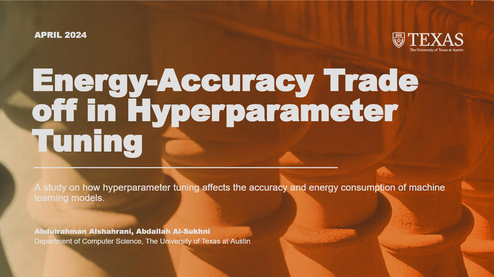

# ⚡Machine Learning Model Energy Consumption Analysis Tool⚡

## Overview

A tool to help measure and analyze how different hyperparameter grid search techniques effect the accuracy and energy consumption of different machine learning models. The code is developed for the associated paper titled "**The Energy-Accuracy Trade-off of Hyperparameter Tuning**".

### Paper:
- You can view the paper from [here](paper.pdf).

### Presentation:
- You can view the presentation from [here](presentation.pdf).

## Code Description

The script `base_model_evalutor.py` utilizes scikit-learn and CodeCarbon libraries to evaluate the energy consumption of a given classifier trained on a given dataset, fine-tuned on given hyperparameter options. The script explores all different combinations of hyperparameters to assess their impact on both accuracy and energy consumption. The different `<model_name>.py` files in the `classifiers` folder run different machine learning algorithms with the set hyperparameter options on the given datasets.

## Prerequisites

- Python: `>=3.7`
- Libraries: `scikit-learn`, `codecarbon`, `setuptools`, `ucimlrepo`, `matplotlib`

Additioonally, you can review the `requirements.txt` file.

## Usage

1. Clone this repository to your local machine.
2. Install the dependencies of the project, specified in `requirements.txt`.
- We recommend setting up a virtual environment like venv or Conda.
For example, here is a way to set up the environment via venv:
    1.  Set up the virtual environment:
`python -m venv .venv`

    2. Activate the virtual environment:
`source ./.venv/bin/activate`
    
    3. Install the dependencies:
`pip install -r requirements.txt`

4. Update your Device's name in `run_tests.py` at line 39.
5. Run the `run_tests.py` script.

### WARNING
Running the code will take a very large amount of time to finish. While the code is running, you might see files that begin with `temp_`, ignore them, as they will be deleted later on.
For best results:
- Make sure you close all other programs and background processes, AND
- Don't use the device while the code is running 

### To adjust the datasets or algorithms
* #### To modify the datasets
Adjust the `dataset` dictionary in `run_tests.py`. The key should represent the name of the datasets, while the value should be a tuple ordered as follows: `(<features>, <labels>)`.

* #### To modify which algorithms to run
Adjust the last 4 lines in `run_tests.py`, each line calls a specific algorithm for all datasets. You can comment out some of them, or potentially implement additional ones.

* #### To adjust the Hyperparameters
Open the intended `<model_name>.py` under the `classifiers` folder and modify the `param_grid` as needed. Each row refers to all options tested in one grid search. For best results:
- Each row should include all the options from the previous hyperparameter and more.
- If a row introduces a new hyperparameter to test, make sure that the range it tests also includes the default value for that hyperparameter. This is done to take into account when the default value is the best value, which would be set in prior rows implicity.

## Results
The `results` folder should separate the results per each device name, according to the `DEVICE_NAME` environment variable set in `run_tests.py`. Each file is formatted as `<dataset_name>_<classifier>_results.csv`. The files under the backup folder contain additional information regarding emissions estimation, which is outside the scope of this repo, but you can take a look at them if you want.

## Plots
To generate the plots for your results, run the corresponding plot scripts from the `plotting_scripts` folder. The scripts will automatically consider the results from all machines in the `results` folder and combine them or separate them as implemented. Thus, if you want to only view the plots for specific machines, you need to remove all the other machine folders temporarily.

## Authors
Abdulrahman Alshahrani, Abdallah Al-Sukhni
